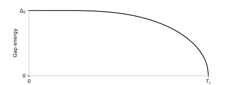

# Examples

A few examples showing detailed usage of the API is provided.

## BCS Gap Energy

In this example, the BCS gap energy plot from the original BCS paper is reproduced.



The code can be found in `./examples/bcs_gap_energy.py` and can be run with

```bash
poetry run ./examples/bcs_gap_energy.py
```

## Compare superconductor conductivities

We look at the superconductor conductivity for niobium calculated with different methods. In the dirty limit ($\lim_{\tau\to0}\tau$) the Zimmermann and Mattis-Bardeen expression are almost indistinguishable. When including the finite scattering rate in the Zimmermann superconductor conductivity the graphs deviate. From the comparison we conclude that scattering has to be taken into account for high frequency problems.


The code can be found in `./examples/superconductor_conductivity_comparison.py` and can be run with

```bash
poetry run ./examples/superconductor_conductivity_comparison.py
```


## Zimmermann's superconductor impurity comparison

We reproduce the impurity comparison from Zimmermann's paper.  The example does take a few seconds to generate the results. 


The code can be found in `./examples/zimmerman_conductivity_impurity_comparison.py` and can be run with

```bash
poetry run ./examples/zimmerman_conductivity_impurity_comparison.py
```